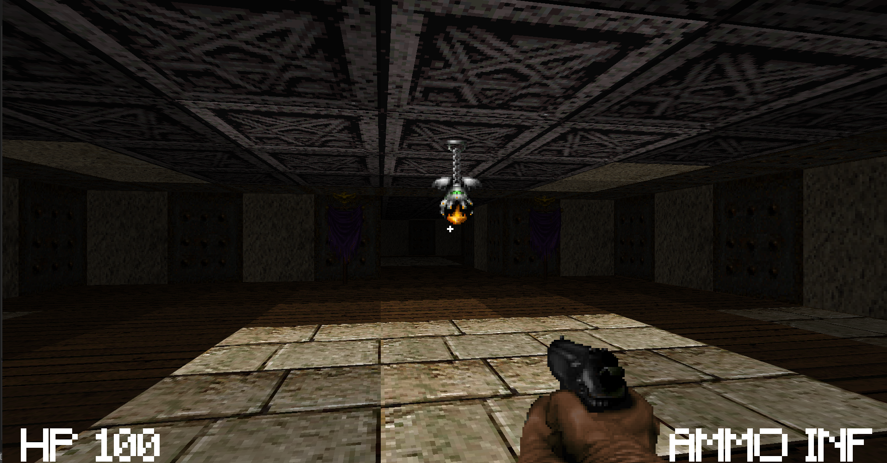

# Ray-shooter

## Raycasted "Wolfenstein/doom like" fps game

## Video
https://www.youtube.com/watch?v=weuWWwH3QYY

## Multithreaded Software Renderer
Raycasting and rendering is done on the cpu. Multiple threads are used for rendering. Each thread is assigned a horizontal slice and then it performs raycasting, draws walls and sprites.  

## Assets
Assets are not my own, except the music. Some assets are taken from https://www.realm667.com/ and other are repurposed from Doom(1993).

## Building
You need visual studio 2022 to build. You also need glfw3.lib which you can get from https://www.glfw.org/download.html. Create a lib folder and place glfw3.lib in the lib folder,
run build_vs2022.bat, and run the solution. Build in either debug or release. Go to bin/release/ and run the exe. The asset folder should be
copied automatically after building, if it doesn't, copy it manually.

## Use at your own risk
